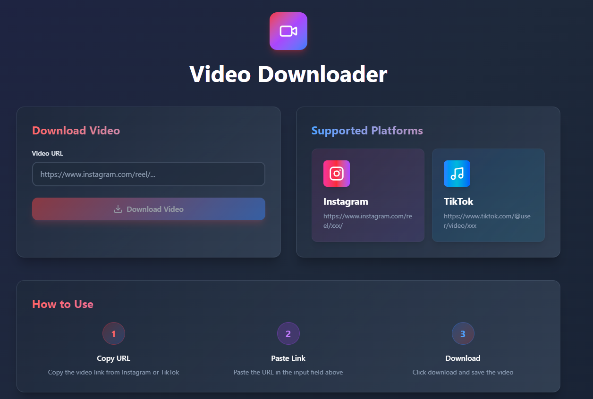

# InstaTok Downloader - Frontend

Front-end side for downloading videos from Instagram and TikTok.

## Features

- Download Instagram Reels
- Download TikTok videos
- Responsive design (mobile-friendly)

## Screenshots


## Tech Stack

- **React 19**
- **TypeScript**
- **Vite**
- **Tailwind CSS v4**
- **Axios**
- **Lucide React**
## Quick Start

### Prerequisites

- Node.js 18+ and npm
- Backend API running (see [backend repo](https://github.com/reibc/instatok-downloader-backend))

### Local Development
```bash
npm install

cp .env.example .env

# Update .env with your backend URL
# VITE_API_BASE_URL=http://localhost:5000

npm run dev

# Open browser
# http://localhost:5173
```

### Docker
```bash
# Build Docker image
docker build -t instatok-frontend .

# Run container
docker run -p 3000:80 instatok-frontend

# Access app
# http://localhost:3000
```